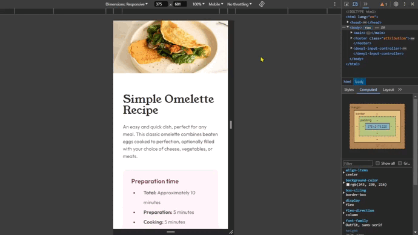

# Frontend Mentor - Recipe page solution



This is a solution to the [Recipe page challenge on Frontend Mentor](https://www.frontendmentor.io/challenges/recipe-page-KiTsR8QQKm).

Frontend Mentor challenges help you improve your coding skills by building realistic projects.

## Table of contents

🔳 [Screenshots](#screenshots-camera)

🔳 [Links](#links-link)

🔳 [Built with](#built-with-hammer_and_pick)

🔳 [What I learned](#what-i-learned-nerd_face)

🔳 [Author](#author-beginner)


## *Screenshots* :camera:


## *Links* :link:

[Live Site URL](https://mendezpvi.github.io/fm-recipe-page/) 👀

[Solution in Frontend Mentor](https://www.frontendmentor.io/solutions/recipe-page-TycMeFxXvK) 👀

[Challenges overcome](https://github.com/mendezpvi/frontend-mentor-challenges) 👀

## *Built with* :hammer_and_pick:

✅ Semantic HTML5 markup

✅ CSS custom properties

✅ Flexbox

✅ Mobile-first workflow

## *What I learned* :nerd_face:

💥 `border-collapse`: this property sets whether cells inside a **\<table>** have shared or separate borders.

💥 `border-spacing`: this property sets distance between the borders of adjacent cells in a **\<table>**. This property applies only when **border-collapse** is **separate**.

```css
.nutrition__table {
  /* code */
  border-collapse: separate;
  border-spacing: 0 0; /* Row spacing */
}
```

## *Author* :beginner:

✨ Frontend Mentor - [@mendezpvi](https://www.frontendmentor.io/profile/mendezpvi)
